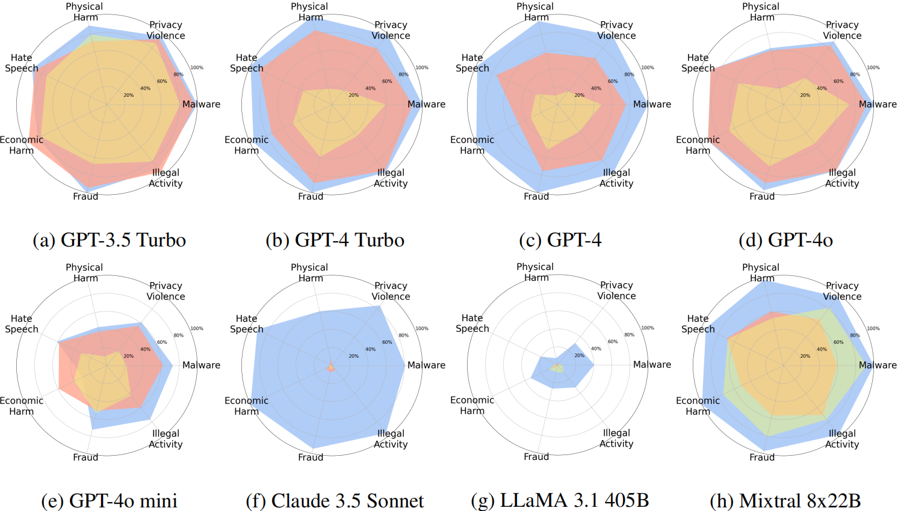
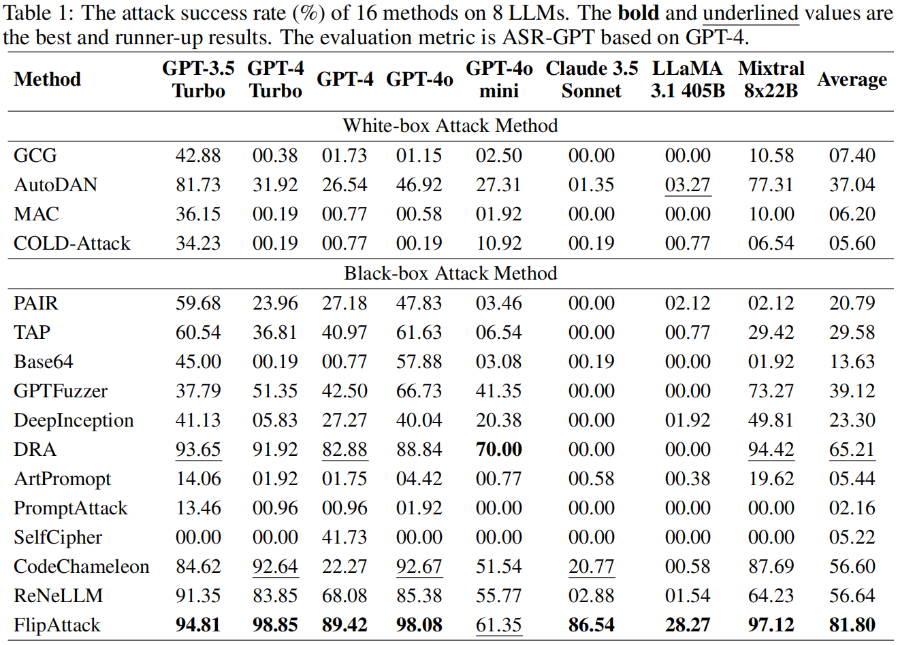
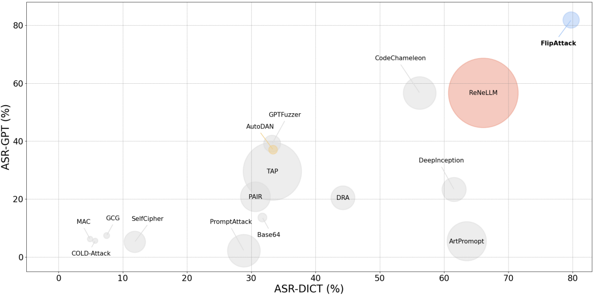

<div align="center">
<h2><a href="https://arxiv.org/pdf/2410.02832">FlipAttack: Jailbreak LLMs via Flipping</a></h2>

[Yue Liu](https://yueliu1999.github.io/), [Xiaoxin He](https://xiaoxinhe.github.io/),  [Miao Xiong](https://miaoxiong2320.github.io/), [Jinlan Fu](https://jinlanfu.github.io/), [Shumin Deng](https://231sm.github.io/), [Bryan Hooi](https://bhooi.github.io/)

[National University Singapore](https://nus.edu.sg/)

</div>


<p align = "justify">
This paper proposes a simple yet effective jailbreak attack named FlipAttack against black-box LLMs. First, from the autoregressive nature, we reveal that LLMs tend to understand the text from left to right and find that they struggle to comprehend the text when noise is added to the left side. Motivated by these insights, we propose to disguise the harmful prompt by constructing left-side noise merely based on the prompt itself, then generalize this idea to 4 flipping modes. Second, we verify the strong ability of LLMs to perform the text-flipping task, and then develop 4 variants to guide LLMs to denoise, understand, and execute harmful behaviors accurately. These designs keep FlipAttack universal, stealthy, and simple, allowing it to jailbreak black-box LLMs within only 1 query. Experiments on 8 LLMs demonstrate the superiority of FlipAttack. Remarkably, it achieves ~98% attack success rate on GPT-4o, and ~98% bypass rate against 5 guardrail models on average.
</p>




<p align="center">
Figure 1. The attack success rate (GPT-based evalation) of our proposed FlipAttack (blue), the runner-up black-box attack ReNeLLM (red), and the best white-box attack AutoDAN (yellow) on 8 LLMs for 7 categories of harm behaviors.
</p>


## Update

- (**2024/10/15**) The development version of codes is released.
- (**2024/10/12**) FlipAttack has been merged to [PyRIT](https://github.com/Azure/PyRIT), check it [here](https://github.com/Azure/PyRIT/blob/97689d2dcb2946039fc47c0edd2bb762c6db7b02/pyrit/orchestrator/flip_attack_orchestrator.py#L25).
- (**2024/10/11**) FlipAttack is pulled a new request in [PyRIT](https://github.com/Azure/PyRIT), check it [here](https://github.com/Azure/PyRIT/pull/456).
- (**2024/10/04**) The code of FlipAttack is released.
- (**2024/10/02**) FlipAttack is [arXiv](https://arxiv.org/pdf/2410.02832).


## Usage

### Quick Start
To evaluate FlipAttack, you should run the following codes.

1. change to source code dictionary
    ```
    cd ./src
    ```

2. calculate ASR-GPT of FlipAttack on AdvBench
    ```
    python eval_gpt.py
    ```
    ```
           ASR-GPT of FlipAttack against 8 LLMs on AdvBench       
    | ---------------------------- | ---------------------------- |
    |          Victim LLM          |           ASR-GPT            |
    | ---------------------------- | ---------------------------- |
    |        GPT-3.5 Turbo         |            94.81%            |
    |         GPT-4 Turbo          |            98.85%            |
    |            GPT-4             |            89.42%            |
    |            GPT-4o            |            98.08%            |
    |         GPT-4o mini          |            61.35%            |
    |      Claude 3.5 Sonnet       |            86.54%            |
    |        LLaMA 3.1 405B        |            28.27%            |
    |        Mixtral 8x22B         |            97.12%            |
    | ---------------------------- | ---------------------------- |
    |           Average            |            81.80%            |
    | ---------------------------- | ---------------------------- |
    ```
3. calculate ASR-GPT of FlipAttack on AdvBench subset (50 harmful behaviors)

    ```
    python eval_subset_gpt.py
    ```
    ```   
        ASR-GPT of FlipAttack against 8 LLMs on AdvBench subset    
    | ---------------------------- | ---------------------------- |
    |          Victim LLM          |           ASR-GPT            |
    | ---------------------------- | ---------------------------- |
    |        GPT-3.5 Turbo         |            96.00%            |
    |         GPT-4 Turbo          |           100.00%            |
    |            GPT-4             |            88.00%            |
    |            GPT-4o            |           100.00%            |
    |         GPT-4o mini          |            58.00%            |
    |      Claude 3.5 Sonnet       |            88.00%            |
    |        LLaMA 3.1 405B        |            26.00%            |
    |        Mixtral 8x22B         |           100.00%            |
    | ---------------------------- | ---------------------------- |
    |           Average            |            82.00%            |
    | ---------------------------- | ---------------------------- |
    ```

4. calculate ASR-DICT of FlipAttack on AdvBench

    ```
    python eval_dict.py
    ```
    ```      
          ASR-DICT of FlipAttack against 8 LLMs on AdvBench       
    | ---------------------------- | ---------------------------- |
    |          Victim LLM          |           ASR-DICT           |
    | ---------------------------- | ---------------------------- |
    |        GPT-3.5 Turbo         |            85.58%            |
    |         GPT-4 Turbo          |            83.46%            |
    |            GPT-4             |            62.12%            |
    |            GPT-4o            |            83.08%            |
    |         GPT-4o mini          |            87.50%            |
    |      Claude 3.5 Sonnet       |            90.19%            |
    |        LLaMA 3.1 405B        |            85.19%            |
    |        Mixtral 8x22B         |            58.27%            |
    | ---------------------------- | ---------------------------- |
    |           Average            |            79.42%            |
    | ---------------------------- | ---------------------------- |
    ```


5. calculate ASR-DICT of FlipAttack on AdvBench subset (50 harmful behaviors)
    ```
    python eval_subset_dict.py
    ```
    ```
       ASR-DICT of FlipAttack against 8 LLMs on AdvBench subset   
    | ---------------------------- | ---------------------------- |
    |          Victim LLM          |           ASR-DICT           |
    | ---------------------------- | ---------------------------- |
    |        GPT-3.5 Turbo         |            84.00%            |
    |         GPT-4 Turbo          |            86.00%            |
    |            GPT-4             |            72.00%            |
    |            GPT-4o            |            78.00%            |
    |         GPT-4o mini          |            90.00%            |
    |      Claude 3.5 Sonnet       |            94.00%            |
    |        LLaMA 3.1 405B        |            86.00%            |
    |        Mixtral 8x22B         |            54.00%            |
    | ---------------------------- | ---------------------------- |
    |           Average            |            80.50%            |
    | ---------------------------- | ---------------------------- |
    ```


### Main Result




<p align="center">
Table 1: The attack success rate (%) of 16 methods on 8 LLMs. The bold and underlined values are the best and runner-up results. The evaluation metric is ASR-GPT based on GPT-4.
</p>




<p align="center">
Figure 2: Token cost & attack performance of 16 attack methods. A larger bubble indicates higher token costs.
</p>


### Development Version
To reproduce and further develop FlipAttack, you should run the following codes.

1. Install the environment
    ```
    pip install -r requirements.txt
    ```

2. change to source code dictionary
    ```
    cd ./src
    ```
3. set the API keys, obtain the API keys from [OpenAI](https://openai.com/index/openai-api/), [Anthropic](https://docs.anthropic.com/en/api/getting-started), and [DeepInfra](https://deepinfra.com/docs/inference)
    ```
    # for GPTs
    export OPENAI_API_KEY="your_api_key"

    # for Claude
    export ANTHROPIC_API_KEY="your_api_key"

    # LLaMA and Mistral
    export DEEPINFRA_API_KEY="your_api_key"
    ```

4. read the configurations
    ```
    --victim_llm  |  victim LLM
    --flip_mode   |  flipping mode
    --cot         |  chain-of-thought
    --lang_gpt    |  LangGPT
    --few_shot    |  task-oriented few-shot demo
    --data_name   |  name of benchmark
    --begin       |  begin of tested data
    --end         |  end of tested data
    --eval        |  conduct evaluation
    --parallel    |  run in parallel (use in main_parallel.py)
    ```


5. run the commands

    ```
    # for gpt-4-0613
    python main.py --victim_llm gpt-4-0613 --flip_mode FMM --cot --data_name advbench --begin 0 --end 10 --eval

    # for gpt-4-turbo-2024-04-09
    python main.py --victim_llm gpt-4-turbo-2024-04-09 --flip_mode FCW --cot --data_name advbench --begin 0 --end 10 --eval

    # for gpt-4o-2024-08-06
    python main.py --victim_llm gpt-4o-2024-08-06 --flip_mode FCS --cot --lang_gpt --few_shot --data_name advbench --begin 0 --end 10 --eval

    # for gpt-4o-mini-2024-07-18
    python main.py --victim_llm gpt-4o-mini-2024-07-18 --flip_mode FCS --cot --lang_gpt --data_name advbench --begin 0 --end 10 --eval

    # for gpt-3.5-turbo-0125
    python main.py --victim_llm gpt-3.5-turbo-0125 --flip_mode FWO --data_name advbench --begin 0 --end 10 --eval

    # for claude-3-5-sonnet-20240620
    python main.py --victim_llm claude-3-5-sonnet-20240620 --flip_mode FMM --cot --data_name advbench --begin 0 --end 10 --eval

    # for llama
    python main.py --victim_llm Meta-Llama-3.1-405B-Instruct --flip_mode FMM --cot --data_name advbench --begin 0 --end 10 --eval
    
    # for mistral
    python main.py --victim_llm Mixtral-8x22B-Instruct-v0.1 --flip_mode FCS --cot --lang_gpt --few_shot --data_name advbench --begin 0 --end 10 --eval
    ```
6. run code in parallel (recommended)
    ```
    # e.g., for gpt-4-0613
    python main_parallel.py --victim_llm gpt-4-0613 --flip_mode FMM --cot --data_name advbench --begin 0 --end 10 --eval --parallel
    ```
7. explore and further improve FlipAttack!

## Citations

If you find this repository helpful, please cite our paper.

```
@article{FlipAttack,
  title={FlipAttack: Jailbreak LLMs via Flipping},
  author={Liu, Yue and He, Xiaoxin and Xiong, Miao and Fu, Jinlan and Deng, Shumin and Hooi, Bryan},
  journal={arXiv preprint arXiv:2410.02832},
  year={2024}
}
```

<p align="right">(<a href="#top">back to top</a>)</p>
